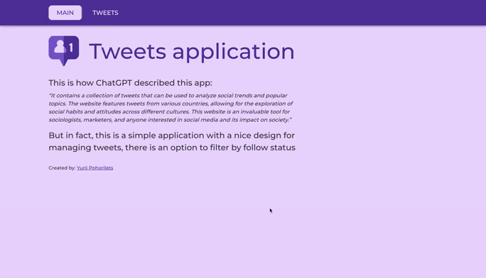

**Read in other languages: [Українська](README.md), [English](README.en.md).**

# Tweets | Test task GoIT

## App view



## Implementation of the project

- The project was compiled with [create-react-app](https://create-react-app.dev/).
- Components are created using the library
  [MUI](https://mui.com/material-ui/getting-started/overview/)
- Used as `backend` [mockapi.io](https://mockapi.io/)
- State management libraries were not used. All the necessary data for the correct operation of the application
   stored in `localStorage`

### Implemented:

1. `Main` page with a short description about the application
2. The `Tweets` page, which displays cards with information about `tweets` (name, count
    of tweets, followers and the Follow button with the option to subscribe to `tweet`)
3. Pagination both when requesting the `backend` and when drawing cards on the page
4. `Back` button to return to the previous page
5. `Dropdown` with the ability to filter cards by `follow` status
6. Automatic redirection of the user in case of switching to a non-existent `route`
7. `Load more` button to receive additional `tweets`. In the case when all existing ones are received
    `tweets` - the button is not displayed
8. Saving the state of `filter` when updating the page or switching to another one
9. Information about the `follow` status is not stored on the `backend`, but locally for each user, which
    allows multiple users to use the application at the same time (see example below)


## Tech Stack


# [View a demo](https://yuriipohorilets.github.io/test-task-tweets/)

---

# Test task:

**Purpose:** to create tweet cards and add interactivity at the click of a button.


<sub>The general appearance of the grater in two states - `Follow` та `Following`</sub>

## Performance criteria

- The layout is fixed in `px`, semantic and valid.
- There are no errors in the browser console.
- The work is done on native `JS` using assemblers or on `React`.
- Interactivity works according to the terms of reference.
- The code is formatted and uncommented.
- A `README.md` should be described in the repository. Short
  [article](https://medium.com/nuances-of-programming/%D0%BA%D0%B0%D0%BA-%D0%BD%D0%B0%D0%BF%D0%B8%D1%81%D0%B0%D1%82%D1%8C-%D0%BA%D1%80%D0%B0%D1%81%D0%B8%D0%B2%D1%8B%D0%B9-%D0%B8-%D0%B8%D0%BD%D1%84%D0%BE%D1%80%D0%BC%D0%B0%D1%82%D0%B8%D0%B2%D0%BD%D1%8B%D0%B9-readme-md-6cc09ef8277),
  with recommendations for design..

## Technical task

1. According to the
   [layout](https://www.figma.com/file/zun1oP6NmS2Lmgbcj6e1IG/Test?node-id=0-1&t=uUlaHyxCuOAc20AW-0)
   you need to implement user cards.
2. When you click on the `Follow` button, the text changes to `Following`. The color of the button
   also changes. And yours is added to the number of followers. That is, the initial number is
   100,500 followers. When you click on the button, it will be 100,501.
3. When the page is updated, the final result of the user's actions should be recorded. That is, if
   you click on button and refresh the page - the button still remains in `Following` state with the
   corresponding color, and the number of followers does NOT decrease to the initial value.
4. When you click the button again, its text and color change to their original state. Also the
   number of followers also changes. It decreases by 1 (100,500).
5. In the code, the number 100,500 must be written with one value (100500). In the UI - displayed
   with a comma (100,500).
6. Create your personal backend for development using the UI service `mockapi.io`. Create a resource
   `users`.
7. Use the resource constructor and describe the user object as described above.

### User

1. Create a local database (a separate `json` file) with the following fields:

   - `id`,
   - `user`,
   - `tweets`,
   - `followers`,
   - `avatar`

<sub><i>(see the code is below).</i></sub>

2. Avatar images must be specified with separate urls in the `avatar` property. You can pick them up
   independently
3. There should be at least 30 users with different data (at your discretion) in the database. Make
   pagination. On one the pagination page should display from 8 to 12 tweets, the rest should be
   loaded when clicked `Load More`
4. According to the database, you need to generate the appropriate number of cards on the front-end
   of the application.
5. Each card must be functionally independent from each other.
6. The rest of the requirements are similar to the technical task described above.

```json
[
  {
    "id": 1,
    "user": "Elon Reeve Musk",
    "tweets": 777,
    "followers": 100500,
    "avatar": "url.jpg"
  }
]
```

## Additional task

> You will be awarded additional points for performance! Without completing an additional task, you
> will not be able to get the maximum score.

- Create routing using `React Router`.
- The application must have the following routes. If the user entered by a non-existent route, his
  must be redirected to the home page.
- `'/'` – component `Home`, home page. (Styling and design at your discretion);
- `'/tweets’` - component `tweets`, page displaying tweets The `tweets` page must have `Back`
  button, which leads to the main page.

## Tasks with an asterisk

Add filtering. It should be a `Dropdown` with 3 options (the layout is up to you): `show all`,
`follow`, `followings`

- `show all` - show all tweets.
- `follow` - show tweets that have status `follow`.
- `followings` - show tweets that have status `following`
