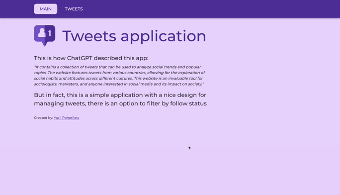
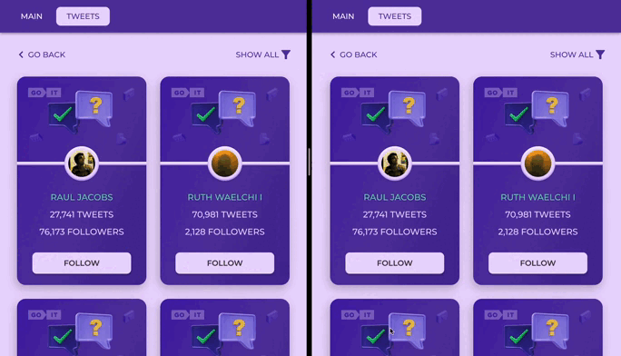
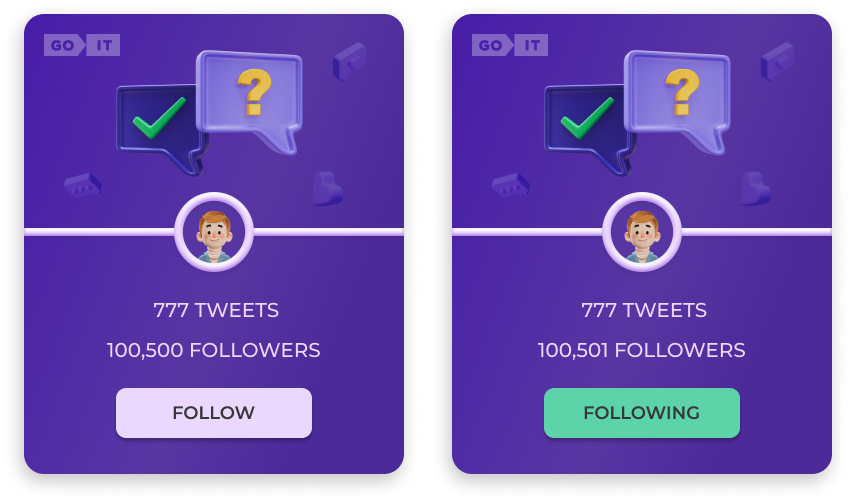

**Читати іншою мовою: [Українська](README.md), [English](README.en.md).**

# Tweets | Тестове завдання GoIT

## Огляд додатку



## Реалізація проекту

- Проект зібраний за допомогою [create-react-app](https://create-react-app.dev/).
- Компоненти створені з використанням бібліотеки
  [MUI](https://mui.com/material-ui/getting-started/overview/)
- В якості `backend` використано [mockapi.io](https://mockapi.io/)
- Бібліотеки управління станом не використовувались. Всі необхідні дані для коректної роботи додатку
  зберігаються в `localStorage`

### Реалізовано:

1. Головна сторінка з коротким описом про додаток
2. Сторінка `Tweets`, на якій відображаються картки з інформацією про `tweet` (імʼя, кількість
   твіттів, підписників та кнопка Follow з можливістю підписатись на `tweet`)
3. Пагінація як, при запиті на `backend`, так і при відмалюванні карток на сторінці
4. Кнопа `back` для повернення на попередню сторінку
5. `Dropdown` з можливістю фільтрації карток за станом `follow`
6. Автоматичне перенаправлення користувача у випадку переходу на неіснуючій `route`
7. Кнопка `load more` для отримання додаткових `tweets`. У випадку, коли отримано всі існуючі
   `tweets` - кнопка не відображається
8. Збереження стану `filter` при оновленні сторінки, або переході на іншу
9. Інофрмація про стано 'follow' зберігажться не на `backend`, а у кожного користувача локально, що
   дає змогу користуватись додатком одночасно декільком користувачам (див. приклад далі)



## Стек технологій


# [Жива сторінка](https://yuriipohorilets.github.io/test-task-tweets/)

---

# Тестове завдання:

**Мета:** створити картки твітів та додати інтерактивності при клікові на кнопку.



<sub>Загальний вигляд картки у двох станах - `Follow` та `Following`</sub>

## Критерії виконання

- Верстка фіксована в `рх`, семантична та валідна.
- Немає помилок в консолі браузера.
- Робота виконана на нативному `JS` з використанням зборщиків або на `React`.
- Інтерактивність працює відповідно до технічного завдання.
- Код відформатований та без коментарів.
- В репозиторії має бути описаний `README.md`. Коротка
  [стаття](https://medium.com/nuances-of-programming/%D0%BA%D0%B0%D0%BA-%D0%BD%D0%B0%D0%BF%D0%B8%D1%81%D0%B0%D1%82%D1%8C-%D0%BA%D1%80%D0%B0%D1%81%D0%B8%D0%B2%D1%8B%D0%B9-%D0%B8-%D0%B8%D0%BD%D1%84%D0%BE%D1%80%D0%BC%D0%B0%D1%82%D0%B8%D0%B2%D0%BD%D1%8B%D0%B9-readme-md-6cc09ef8277),
  з рекомендаціями щодо оформлення..

## Технічне завдання

1. Відповідно до
   [макету](https://www.figma.com/file/zun1oP6NmS2Lmgbcj6e1IG/Test?node-id=0-1&t=uUlaHyxCuOAc20AW-0)
   потрібно реалізувати картки юзера.
2. При клікові на кнопку `Follow` - текст змінюється на `Following`. Також змінюється колір кнопки.
   А до кількості фоловерів додається і ваш. Тобто, початкова кількість складає 100,500 фоловерів.
   При клікові на кнопку буде 100,501.
3. При оновлені сторінки має фіксуватись кінцевий результат дій юзера. Тобто, якщо клікнути по
   кнопці і оновити сторінку - то кнопка все рівно залишається в стані `Following` із відповідним
   кольором, а кількість фоловерів НЕ зменшується до початкового значення.
4. При повторному клікові на кнопку її текст та колір змінюються до початкового стану. Також
   змінюється і кількість фоловерів. Вона зменшується на 1 (100,500).
5. В коді цифра 100,500 має бути прописана одним значенням (100500). В UI - виведено через кому
   (100,500).
6. Створи свій персональний бекенд для розробки за допомогою UI-сервісу `mockapi.io`. Створи ресурс
   `users`.
7. Використай конструктор ресурсу та опиши об'єкт юзера, як описано вище.

### User

1. Створюєте локальну базу даних (окремий файл `json`) з наступними полями:

   - `id`,
   - `user`,
   - `tweets`,
   - `followers`,
   - `avatar`

<sub><i>(див. код нижче).</i></sub>

2. Зображення аватарів мають бути прописані окремими url у властивості `avatar`. Можете підібрати їх
   самостійно.
3. Має бути від 30 юзерів з різними даними (на ваш розсуд) в базі. Зроби пагінацію. На одній
   сторінці пагінації має відображатися від 8 до 12 твітів, решта підгружатись при натисканні
   `Load More`
4. Відповідно до бази потрібно згенерувати відповідну кількість карток на фронт-частині застосунку.
5. Кожна картка має бути незалежною функціонально одна від одної.
6. Решта вимог аналогічні до вищеописаного технічного завдання.

```json
[
  {
    "id": 1,
    "user": "Elon Reeve Musk",
    "tweets": 777,
    "followers": 100500,
    "avatar": "url.jpg"
  }
]
```

## Додаткове завдання

> За виконання вам будуть нараховані додаткові бали! Без виконання додаткового завдання ви не
> зможете отримати максимальний бал.

- Створи маршрутизацію, використовуючи `React Router`.
- У застосунку повинні бути такі маршрути. Якщо користувач зайшов за неіснуючим маршрутом, його
  необхідно перенаправляти на домашню сторінку.
- `'/'` – компонент `Home`, домашня сторінка. (Стилізація та оформлення на ваш розсуд);
- `'/tweets’` - компонент `tweets`, сторінка із відображенням твітів На сторінці `tweets` має бути
  кнопка `Back`, яка веде на головну сторінку.

## Завдання із зірочкою

Додай фільтрацію. Це має бути `Dropdown` із 3 опціями (оформлення на ваш розсуд): `show all`,
`follow`, `followings`

- `show all` - показати всі твіти.
- `follow` - показати твіти, у яких стан `follow`.
- `followings` - показати твіти, у яких стан `following`
